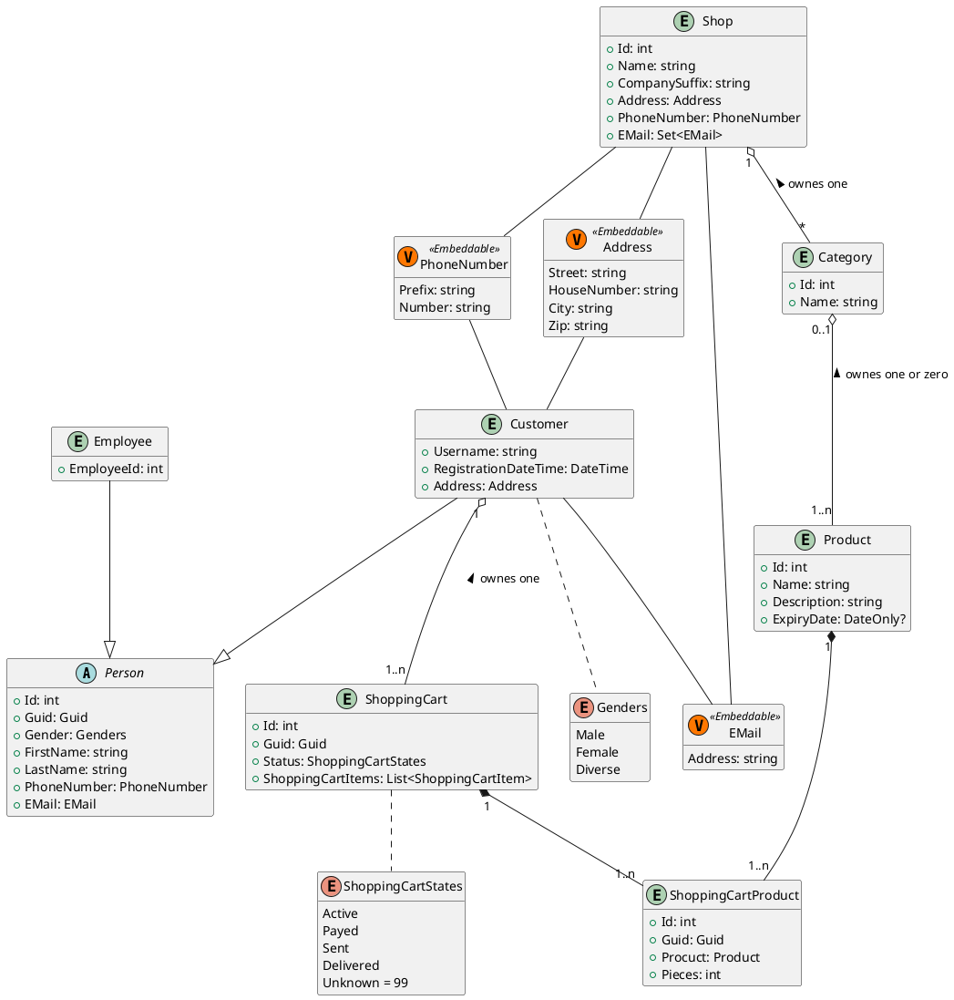

# Shiny Flakes

Beschreibung...

## Team

* A
* B

### asdasdas

x **Fett** ADASDASD *Kursiv* asdads ** sadfaddasdsa ***FETTKursiv***

#### asdasdsddas

x

##### asdasdsadsadasdasd

1. Punkt 1
1. Punkt 2
1. Punkt 3
1. Punkt 4

## C# Example

```C#
SchoolClass scB401 = new SchoolClass() { RoomNumber = "B4.01" };
MyList<SchoolClass> schoolClasses = new MyList<SchoolClass>()
{
    scB401,
    new SchoolClass() { RoomNumber = "B4.02" },
    new SchoolClass() { RoomNumber = "B4.02" },
    new SchoolClass() { RoomNumber = "B4.03",
        Students = new List<Student>()
        {
            new Student() { FirstName="Martin", Lastname="Schrutek" },
            new Student() { FirstName="Martin1", Lastname="Schrutek1" },
            new Student() { FirstName="Martin2", Lastname="Schrutek2" },
            new Student() { FirstName="Martin3", Lastname="Schrutek3" },
            new Student() { FirstName="Martin4", Lastname="Schrutek4" },
        }
    }
};
```

## HTML Example

```html
<h1>Welcome!!</h1>
```

## Domain Model



xxxx